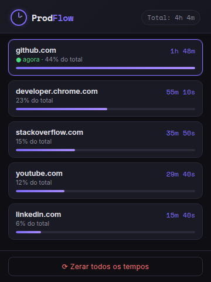

# ⏱️ ProdFlow

**Extensão para Google Chrome que mostra quanto tempo você passa em cada site.**
Todos os dados ficam no seu navegador: nada é enviado para servidor nenhum.

<p align="center">
  
</p>

## Funcionalidades

- **Ranking por site**: abas diferentes do mesmo site somam juntas (`youtube.com` e `www.youtube.com` contam como um só).
- **Contagem ao vivo**: o site atual aparece destacado e o tempo dele corre em tempo real no popup.
- **Só conta quando você está usando**: pausa ao sair do Chrome, ao bloquear a tela ou após 5 minutos sem mexer no computador (a não ser que a aba esteja tocando áudio, como um vídeo).
- **Não perde dados**: o progresso é salvo a cada minuto e sobrevive ao fechamento do navegador.
- **Zerar tudo** com um clique.
- **100% local**: sem backend, sem analytics, sem fontes externas.

## Como instalar

1. Baixe este repositório (**Code → Download ZIP**) e extraia, ou clone com `git clone`.
2. No Chrome, abra `chrome://extensions`.
3. Ative o **Modo do desenvolvedor**, no canto superior direito.
4. Clique em **Carregar sem compactação** e selecione a pasta do projeto (a que tem o `manifest.json`).
5. Fixe o ProdFlow na barra de extensões e navegue normalmente.

## Como funciona

```
Eventos do Chrome                   Service worker                     Popup
─────────────────                   ──────────────                     ─────
troca de aba          ─┐
navegação na aba       │      ┌─▶ qual site está em foco agora?
troca de janela        ├─▶ fila ─▶ mudou? soma o tempo ao site ─▶ storage.local ─▶ ranking
ausência / bloqueio    │      └─▶ abre nova sessão ────────────▶ storage.session ─▶ "● agora"
alarme (1 min)        ─┘
```

- O **service worker** (`src/background/service-worker.js`) guarda no máximo uma "sessão" por vez: o site da aba ativa na janela em foco. Quando algo muda, ele encerra a sessão, soma os segundos ao domínio e abre outra.
- A sessão fica em `chrome.storage.session`, não em variáveis. No Manifest V3 o Chrome desliga o service worker após cerca de 30 segundos sem eventos, e tudo que está só na memória se perde.
- Todos os eventos passam por uma **fila**, para que duas gravações simultâneas no storage não apaguem a soma uma da outra.
- O **popup** (`src/popup/`) só lê os dados e desenha a lista. Para zerar, ele pede ao service worker por mensagem, que é quem grava os dados.

### Estrutura

```
├── manifest.json
├── src/
│   ├── background/service-worker.js   # rastreamento
│   ├── popup/                         # interface (HTML, CSS, JS)
│   └── shared/utils.js                # funções puras: domínio, formatação, ranking
├── test/                              # testes automatizados (node:test)
├── assets/fonts/                      # Inter e Space Mono (licença OFL)
├── icons/
└── docs/
```

## Testes

O projeto tem testes automatizados que simulam a API do Chrome: troca de abas, janelas, ausência, o service worker sendo desligado, eventos simultâneos e mais. Não precisa instalar nada além do [Node.js](https://nodejs.org) 20 ou superior.

```bash
npm test
```

## Privacidade

O ProdFlow guarda apenas o **domínio** dos sites (ex.: `github.com`) e os segundos acumulados, no armazenamento local da extensão. Ele não guarda endereços completos, títulos de páginas nem histórico, e não faz nenhuma requisição de rede.

| Permissão | Para quê |
|-----------|----------|
| `tabs` | Saber o endereço da aba ativa |
| `storage` | Guardar os tempos |
| `idle` | Pausar quando você está ausente |
| `alarms` | Salvar o progresso a cada minuto |

## O que aprendi com esse projeto

**Na primeira versão:**

- Como utilizar as APIs do Chrome
- Como funcionam extensões na prática (service workers, Manifest V3)
- Como salvar dados com `chrome.storage` sem perder informação entre sessões
- A diferença entre o popup e o service worker (eles não compartilham memória, aprendi isso na prática rs)
- Como testar situações inesperadas: aba fechada antes de salvar, janela perdendo foco, várias janelas abertas

**Na versão 2.0, revisando o código:**

- **O service worker pode morrer a qualquer momento.** Variáveis globais não são confiáveis no MV3; o estado precisa ficar no `storage.session`.
- **Race conditions existem até em JavaScript.** Duas leituras e gravações assíncronas em paralelo podem perder dados; uma fila de Promises resolve.
- **IDs de aba não são permanentes.** Eles mudam quando o navegador reinicia, então salvar por ID fazia o histórico virar "Aba fechada". Agrupar por domínio resolveu isso e ainda cumpriu o que a extensão prometia.
- **Segurança (XSS):** colocar dados vindos de sites em `innerHTML` permite injetar HTML na extensão. Troquei por `textContent`.
- **Testes automatizados** com `node:test` e um mock da API do Chrome, para reproduzir cenários difíceis de testar na mão.

## Próximos passos

- [ ] Histórico por dia e semana
- [ ] Lista de sites ignorados
- [ ] Exportar os dados em CSV
- [ ] Meta diária por site, com aviso

## Autor

Feito por **Ruan Souza**, estudante de Análise e Desenvolvimento de Sistemas no Senac PR.
[LinkedIn](https://www.linkedin.com/in/ruan-souzadev)

Licença [MIT](LICENSE).
